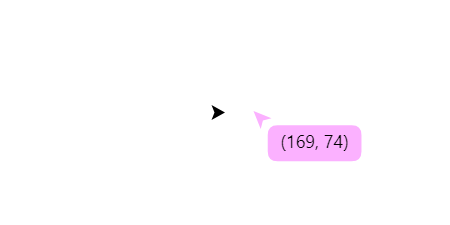
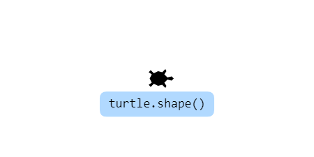
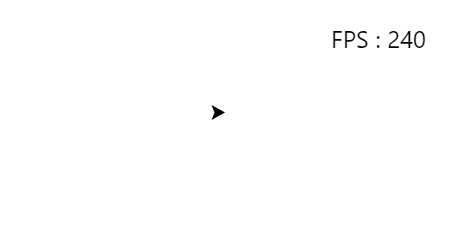

import { Steps } from 'nextra/components'

# Usage

## Use [Built-in plugins](#built-in-plugins)

<Steps>
### Enable
```js copy
t.enable('built-in-plugin-name')
```

### Plugin is enabled
</Steps>

## Use your plugin

<Steps>
### Register
```js copy
t.register(yourPlugin)
```

### Enable
```js copy
t.enable('your-plugin-name')
```

### Plugin is enabled
See also [Methods](./methods), [Create](./create)
</Steps>

## Built-in plugins

- `mouse-coordinate`: Displays the coordinates of the cursor in the turtle screen.

    

- `turtle-action`: Displays the currently called function below the turtle.

    

- `turtle-fps`: Displays the FPS of the turtle screen in the upper right corner.

    